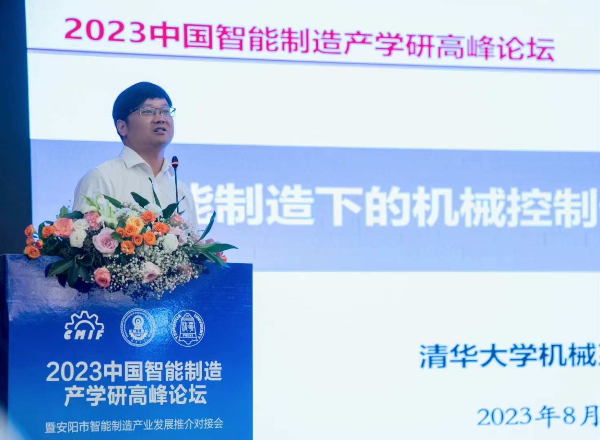

# About Teacher

## 胡楚雄 机械工程系 正教授 博士生导师

## Hu Chuxiong, Professor, Ph.D. Supervisor, Department of Mechanical Engineering

  
  

* 清华大学教务处副处长、机械系长聘教授、博导，曾任清华大学党委办公室副主任、机械系党委副书记、副系主任。
* 从事IC光刻机、CNC数控机床、机器人相关的精密/智能机电控制科研工作，获国家青拔、国家优青、国家教学成果奖一等奖、北京市杰青、北京市技术发明奖一等奖、北京市自然科学奖二等奖、清华大学学术新人奖/青教奖/双带头人党支部书记等，是IEEE TII、IEEE/ASME TMech编委。
* 多次被评为“清华大学毕业生心目中的好教师及课程”，负责的课程于2020年入选首批国家级一流本科课程，指导的学生多人获清华大学特奖。
