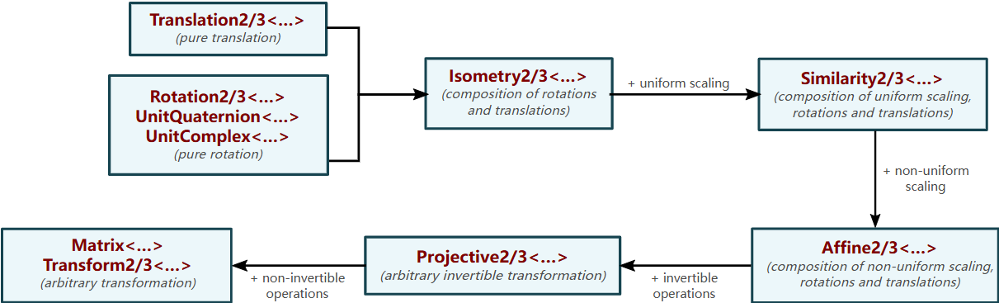
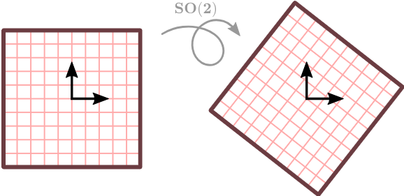
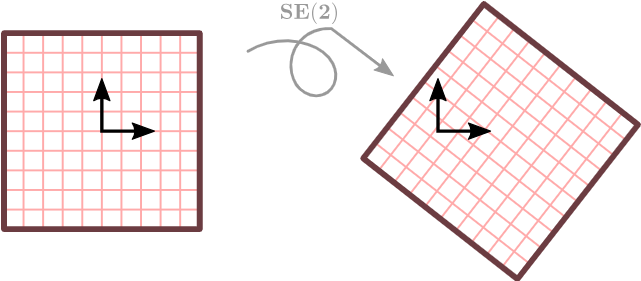
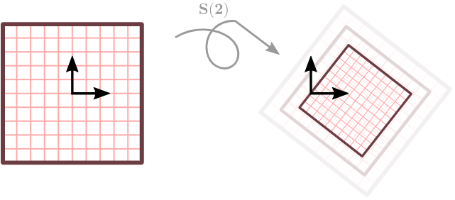
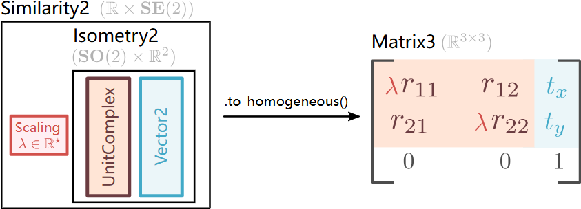

# 机械臂: 空间变换

## Transformations

Transformations are algebraic entities that act on points and vectors to change their coordinates.
  

- Rotations

A rotation is an invertible origin-, distance- and orientation-preserving transformation. It is commonly known by algebraists as the n-dimensional Special Orthogonal group $\mathbf{S O}(\mathrm{n})$ :

旋转可以使用旋转矩阵或者旋转欧拉角表示。特别的，二维平面内的旋转可以使用单位复数表示，三维平面内的旋转可以使用单位四元数表示。关于四元数的运算以及单位四元数与空间变换的关系可见：[四元数](https://zh.wikipedia.org/wiki/%E5%9B%9B%E5%85%83%E6%95%B8)，[四元数与空间旋转](https://zh.wikipedia.org/wiki/%E5%9B%9B%E5%85%83%E6%95%B0%E4%B8%8E%E7%A9%BA%E9%97%B4%E6%97%8B%E8%BD%AC)。

- Translations

- Direct isometries

Direct isometries are rotations followed by translations, i.e., they preserve orientations and distances, but not the origin. They are commonly known by algebraists as the n-dimensional Special Euclidean group $\mathbf{S E}(\mathrm{n})$.
  

Direct isometries are commonly used to represent the position and orientation of a solid object or a camera. Convenient constructors are thus provided to center and orient an isometry as if it was the head of an observer

While the right-handed look-at and the observer-frame isometries are closely related (they are inverses of each other), they have very different semantic meanings. The former will typically be used in the context of rendering a scene. Indeed, we want to bring the objects into the local space of the camera for rendering. The latter will typically be used to orient a solid, a robot, a head, etc. because, in that case, we want to be able to localize our object into the global scene.

- Similarity

A similarity is an uniform scaling, followed by a rotation, followed by translation. Thus, it preserves angle sizes and maps parallel lines to parallel lines. Orientation is lost if the scaling factor is negative. They are usually known by algebraists as the n-dimensional Similarity group $\mathbf{S}(\mathrm{n})$.
  

- Affine
- Projective

## Homogeneous coordinates

We are used to work with cartesian coordinates. However, it has some limitations when it comes to represent transformations in matrix form. For example, the translational part of an isometry cannot be expressed in cartesian coordinates in a compact way (using a matrix). That's why homogeneous coordinates exist: rotations, scaling, and translations can all be combined in a single matrix of higher dimension than the euclidean space we are working with.

Any affine transformation have equivalent representations as raw matrices. In particular, any 2D affine transformation is representable as a Matrix3, and any 3D affine transformation is representable as a Matrix4. Each such raw matrix is known as the homogeneous coordinates of the corresponding transformation. The following example shows the homogeneous coordinate matrix of a 2D similarity.

  

通常我们会确保矩阵的右下角为 1，以便确保变换对应的齐次矩阵唯一。

齐次变换矩阵被广泛的应用在计算机图形学、机器人学、计算机视觉等领域。
